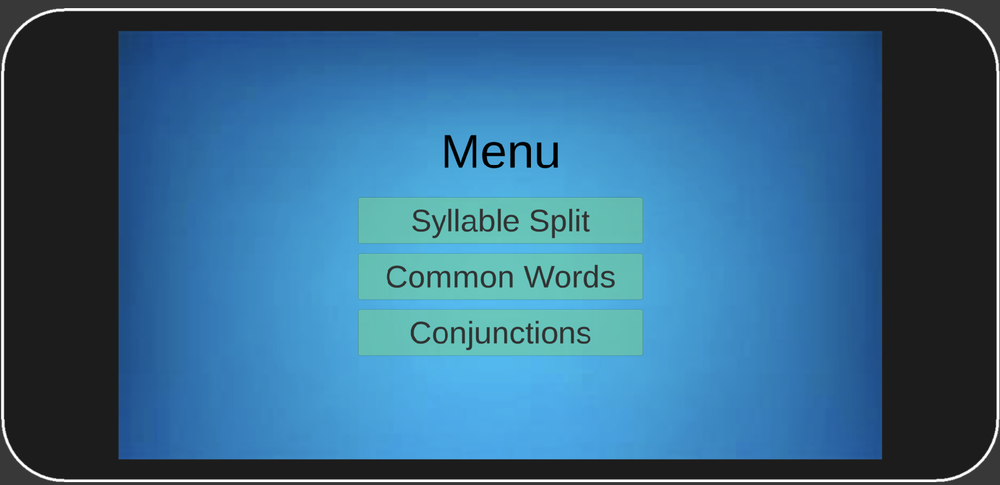
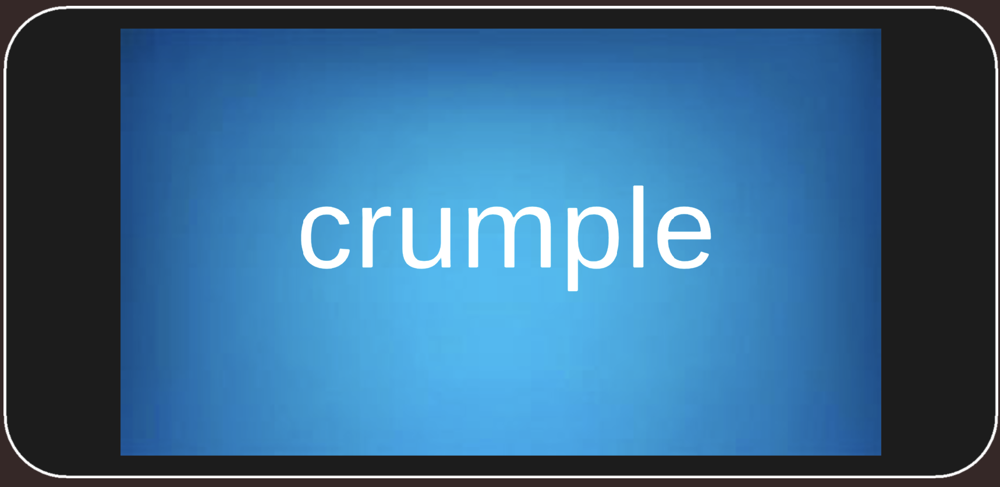

# Dyslexia App

### _Max Calcoen, uploaded July 17, 2023_

Home Menu:

Syllable Split:

After being presented the word, the user is asked to use their finger to split the word on a touchscreen screen into its distinct syllables. The system then recognizes whether or not the split has been done correctly, and provides feedback based on the accuracy of the split.
